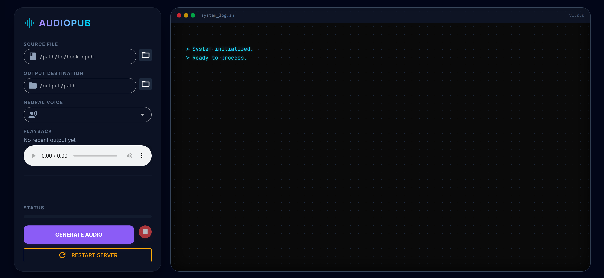

# Audiopub



**Turn your EPUBs into high-fidelity audiobooks locally.**

Audiopub is a slick, desktop-based power tool that converts ebooks into chapterized .m4b audiobooks using **Supertone's Supertonic TTS**. It runs entirely on your machine—no cloud APIs, no per-character fees.

## Features

*   **⚡ Local & Private:** Powered by ONNX Runtime. Zero data leaves your rig.
*   **💎 Deep Dark UI:** A beautiful, responsive glass-morphism interface built with NiceGUI.
*   **🧠 Smart Context:** Splits text intelligently by sentence to maintain narrative flow.
*   **⏯️ Resumable:** Crash? Quit? No problem. Resume exactly where you left off.
*   **📦 Auto-Muxing:** Outputs ready-to-listen `.m4b` files with proper metadata and chapters.

## Quick Start

1.  **Install:**
    ```bash
    git clone https://github.com/yourusername/audiopub.git
    cd audiopub
    git lfs pull  # Essential: Downloads the AI models
    pip install -r requirements.txt
    ```

2.  **Run:**
    ```bash
    export PYTHONPATH=$PYTHONPATH:.
    python audiopub/main.py
    ```

3.  **Generate:**
    *   Open the UI (it launches automatically).
    *   Select your EPUB and Voice.
    *   Hit **Generate**.

## Requirements

*   **Python 3.9+**
*   **FFmpeg** (Must be in your PATH)
*   **Git LFS** (For model weights)

## Voice Styles

Drop your custom `.json` voice style configs into `audiopub/assets/`. The app will auto-detect them.

---
*Built for audiophiles who code.*
